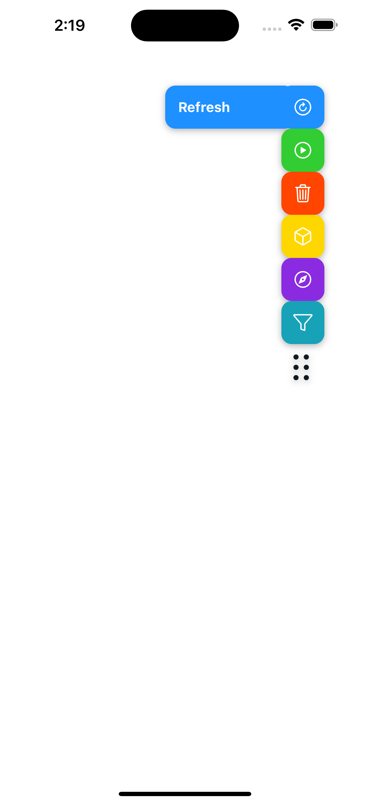
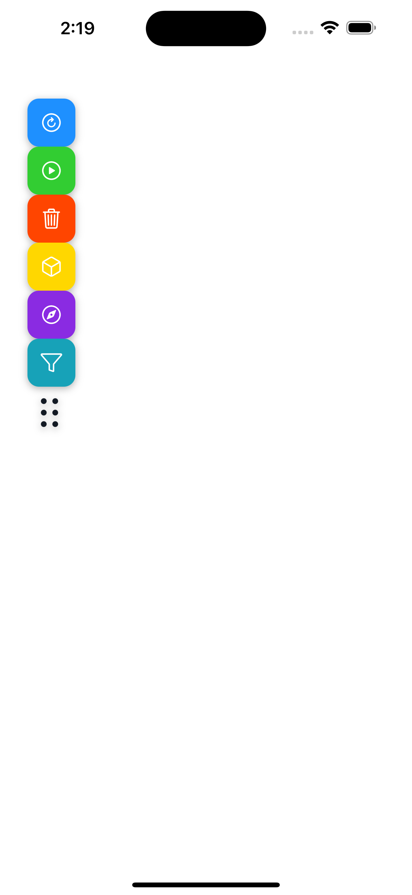
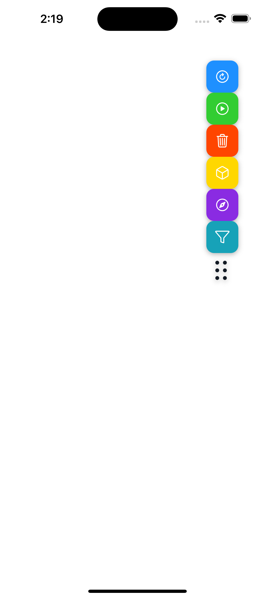

# Toolbar Playground

This project showcases an interactive and draggable toolbar built using **React Native**, **Reanimated**, and **Gesture Handler**. The toolbar supports:

- **Scrollable items** inside the toolbar.
- **Dragging individual buttons** to activate options.
- **Moving the entire toolbar** around the screen.

## 📸 Screenshots

| Regular Toolbar | Dragging an Item | Moving the Toolbar |
|----------------|-----------------|-------------------|
|  |  |  |

## 🚀 Features

- **Draggable Toolbar**: Move the toolbar freely around the screen.
- **Scrollable Toolbar Items**: Scroll vertically when there are more options.
- **Gesture-Based Interactions**: Tap, drag, and swipe actions handled smoothly.
- **Animated Transitions**: Fluid animations with `react-native-reanimated`.
